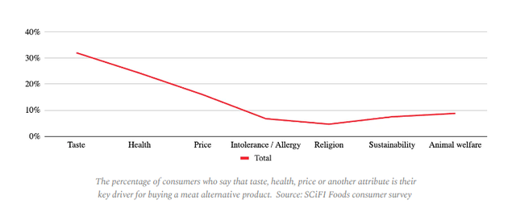

```{r setup, include=FALSE}
knitr::opts_chunk$set(echo = TRUE)
knitr::opts_chunk$set(fig.height=8, fig.width=13)
knitr::opts_chunk$set(warning = FALSE, message = FALSE) 
```

```{r}
# Desactivamos la notación científica. ¿A quién le gusta ver en sus gráficos números como
# 1e25?
options(scipen = 999) 

# Cargamos las librerías necesarias para pintar
library(ggplot2) # Nuestra biblia a partir de ahora
library(scales) # Nos ayudará a mejorar el aspecto de nuestros gráficos
library(tidyverse) # Necesario si queremos realizar algún tratamiento en los datos

# Establecemos un tema por defecto para nuestros gráficos
# Personalmente soy fanático de theme_bw(), es el tema clásico 'dark-on-light'
# ggplot ofrece un listado de temas completos que puedes aprovechar. Echa un vistazo:
# https://ggplot2.tidyverse.org/reference/ggtheme.html

# Hay gente que realiza sus propios temas, generando auténticas obras de arte, ¿te atreves?
theme_set(theme_bw())

## Dataset ejercicio 2
df1 <- mtcars %>% as_tibble()

## Eliminamos missings
df1 <- df1 %>% drop_na()

## Dataset ejercicio 3
df2 <- mpg %>% as_tibble()

## Eliminamos missings
df2 <- df2 %>% drop_na()


```

# Primer ejercicio

Indica todos los sesgos que detectas en las siguientes imágenes:


```{r se1, echo=FALSE, fig.cap="Primer gráfico", out.width = '40%'}

```

- Sesgo de escala: Las barras azules que representan el consumo de gas tienen 
aproximadamente el mismo tamaño visual, a pesar de que los valores son muy
diferentes (508.86 kWh vs 17207.83 kWh). Esto minimiza visualmente el gran
aumento en el consumo.

- Falta de contexto: No se proporciona información sobre las razones del
aumento drástico del consumo, lo que podría llevar a conclusiones erróneas.

```{r se2, echo=FALSE, fig.cap="Segundo gráfico", out.width = '40%'}

```

- Sesgo de truncamiento: El eje Y comienza en 0% y termina en 40%, exagerando
visualmente las diferencias entre los valores.

- Sesgo de etiquetado incompleto: Solo se muestra una línea "Total" sin
explicar qué representa o cómo se relaciona con las categorías del eje X.

- Falta de datos: No se muestran los valores numéricos exactos para cada
punto, dificultando la interpretación precisa.


```{r se3, echo=FALSE, fig.cap="Tercer gráfico", out.width = '40%'}

```

- Sesgo de escala: El eje Y está muy comprimido, exagerando visualmente
pequeños cambios en los valores.

- Sesgo de recorte: El eje Y no comienza en cero, lo que puede exagerar la
magnitud del aumento reciente.

- Falta de contexto: No se proporciona información sobre qué es "DAU" o
por qué el aumento reciente es "prometedor".

- Sesgo de selección de tiempo: Mostrar solo los últimos 180 días puede ocultar
tendencias a largo plazo o fluctuaciones estacionales.

# Segundo ejercicio

Genera un scatterplot que:

1) Relacione la **variable wt** o Peso en libras (eje X) y **mpg** o consumo en Millas/galón (eje Y) del dataset mtcars (nativo en R)

2) Colorea los puntos utilizando la variable **cyl**

3) Añada por etiquetas el **modelo de coche**

# -- SCATTERPLOT --

ggplot(df1, aes(x = wt, y = mpg, color = factor(cyl))) +
  geom_point() +
  geom_text(aes(label = rownames(df1)), vjust = 1.5, hjust = 0.5, size = 3) +
  labs(title = "Relación entre peso y consumo de combustible",
       x = "Peso (libras)",
       y = "Consumo (Millas/galón)",
       color = "Cilindros") +
  theme_minimal()


# Tercer ejercicio

Construye un boxplot que:

1) Compare el consumo (**hwy** - highway miles per gallon) con la clase de coche (**class** - type of car)

2) Colorea según el **tipo de coche**

3) Añade una **escala de color distinta** a la que viene por defecto

# -- BOXPLOT --

ggplot(df2, aes(x = class, y = hwy, fill = class)) +
  geom_boxplot() +
  labs(title = "Consumo en autopista por clase de coche",
       x = "Clase de coche",
       y = "Consumo en autopista (millas/galón)",
       fill = "Clase de coche") +
  scale_fill_viridis_d() +
  theme_minimal() +
  theme(axis.text.x = element_text(angle = 45, hjust = 1))

# Cuarto ejercicio

En base a los dos problemas anteriores, responde a las siguientes preguntas:

1) **¿Cómo están relacionadas las variables wt y mpg del scatterplot?**

- La relación entre wt y mpg suele ser inversa: a mayor peso, menor consumo
de millas por galón (es decir, mayor consumo de combustible).

2) **¿Qué tipos de coche consumen menos combustible?**

- Para determinar qué tipos de coche consumen menos combustible, deberías
buscar en el boxplot las clases de coche que tienen los valores más altos de
"hwy" (millas por galón en autopista), ya que un valor más alto indica un menor
consumo de combustible.
